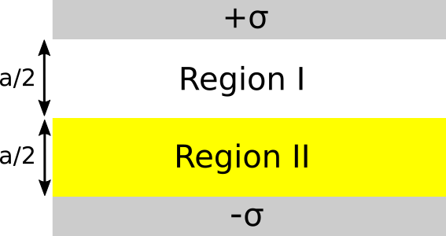

### 1. Capacitor with dielectric

You have a large (infinite in the $x-y$ directions) parallel-plate conductor (two big metal sheets, the upper one has free charge density $+\sigma$, the lower one $-\sigma$). The plates are a distance $a$ apart. The space between the sheets is half filled with a linear dielectric oil with given dielectric constant $\varepsilon_r = 4$. Region  I, (filling the top half of the volume) is vacuum. The lower half, region II, is the dielectric oil. See the figure below.

1. Find $\mathbf{D}$, $\mathbf{E}$, and $\mathbf{P}$ (direction and magnitude, giving all of them separately in regions I and II).
2. Find the location and amount of bound charge (surface and volume) everywhere.
3. Given this, go back and compute $\mathbf{E}$ in region I and II  to check your answers for part 1.
4. Find the voltage between the plates. If the plates are very large but not infinite, compare the capacitance before and after you added the dielectric oil. How does it compare with what you would get if you filled the entire region with that dielectric oil?
