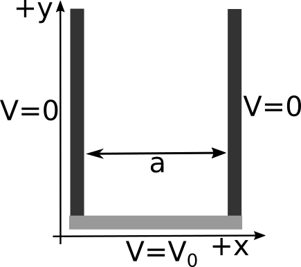
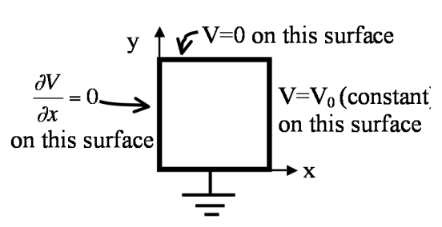

## 1. Potential and electric field with Laplace's equation

In class we derived the solution for the 2D version of Laplace's equation with the boundary conditions shown below.




That solution was analytic, but it contained an infinite series:

$$V(x,y) = \sum_{n=1,3,5,\dots}^{\infty} \dfrac{4 V_0}{\pi n} \sin \left(\dfrac{n\pi x}{a}\right)e^{-\dfrac{n\pi y}{a}}$$


While perfectly analytic, this solution is hard to visualize. What does that solution look like? Take $V_0 = 10V$ and $a = 1m$.

1. Plot the approximate solution in 3D space using Python's ```mplot3D``` for just the first term in the sum (i.e., only for $n = 1$). Download this [Jupyter notebook](../jupyter/HW7-3dPotentialPlot.ipynb) (you can [view it here](https://github.com/dannycab/phy481msu_f2017/blob/master/jupyter/HW7-3dPotentialPlot.ipynb)), which walks you through how to plot in 3D.
2. Plot the approximate solution in 3D space for the first 5 terms. What do you notice about the boundary where $V=V_0$?
3. Plot the approximate solution such that the boundary where $V=V_0$ looks very close to constant. How many terms did you need? If you didn't do it for Part 2, you will have to figure out how to automatically compute each term to construct your plot instead of copying-and-pasting 50, or 100, or 1000 times!
4. Given this plot of the potential, sketch (by hand) what the electric field looks like. Recall that $\mathbf{E} = -\nabla V$.


## 2. Potential in a cubical box

You have a cubical box (sides all of length $a$) made of 6 metal plates that are insulated from each other. The left wall is located at $x=-a/2$ and the right wall is at $x=+a/2$. Both left and right walls are held at constant potential $V=V_0$. All four other walls are grounded ($V=0$ for these walls).

(Note that we've set up the geometry so the cube runs from $y=0$ to $y=a$, and from $z=0$ to $z=a$,  but from $x=-a/2$ to $x=+a/2$  This should actually make the math work out a little easier!)

1. Find the potential $V(x,y,z)$ everywhere inside the box.
2. Also, is V=0 at the center of this cube?
3. Is E=0 there? Why, or why not?

## 3. Separation of variables - Cartesian 2D with new Boundary Conditions

A square rectangular pipe (sides of length $a$) runs parallel to the z-axis (from $-\infty$ to $\infty$)  The 4 sides are maintained with boundary conditions given in the figure. (Each of the 4 sides is insulated from the others at the corners).




1. Find the potential $V(x,y,z)$ at all points in this pipe.
2. Sketch the E-field lines and equipotential contours inside the pipe. (Also, state in words what the boundary condition on the left wall means - what does it tell you? Is the left wall a conductor?)
3. Find the charge density $\sigma(x,y=0,z)$ everywhere on the bottom conducting wall $(y=0)$.

## 4. Reminders about Gauss' Law
