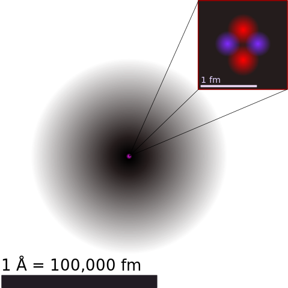
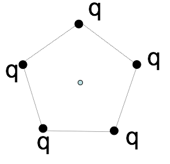
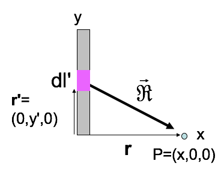

<section data-markdown>
Consider a vector field defined as the gradient of some well-behaved scalar function:
$$\mathbf{v}(x,y,z) = \nabla T(x,y,z).$$

What is the value of $\oint_C \mathbf{v} \cdot d\mathbf{l}$?

1. Zero
2. Non-zero, but finite
3. Can't tell without a function for $T$

Note:
* CORRECT ANSWER: A
* Closed loop integral of a gradient is zero.
* Fall 2016: [92] 4 4 0 0

</section>

<section data-markdown>

## Announcements

* Homework 1 solutions posted immediately after class
* Graded Homework 1 returned next Friday
* Homework 2 posted (due next Wednesday)

</section>

<section data-markdown>
# Let the shaming begin
</section>

<section data-markdown>
## Register your clicker!

- Agrawal, Prakash
- Bloomfield, Brandon
- Campbell, Megan
- Everett, Nathan
- Klebba, Jared
- Prince, Alex
- Spencer, Spence
- Verleye, Erick
- Wu, Madeleine
- Xu, Fu
</section>

<section data-markdown>

For me, the first homework was ...

1. entirely a review.
2. mostly a review, but it had a few new things in it.
3. somewhat of a review, but it had quite a few new things in it.
4. completely new for me.

</section>

<section data-markdown>
I spent ... hours on the first homework.

1. 1-2
2. 3-4
3. 5-6
4. 7-8
5. More than 9
</section>

<section data-markdown>

## Numerical Integration

</section>

<section data-markdown>

Consider this trapezoid

What is the area of this trapezoid?

1. $f(c)h$
2. $f(d)h$
3. $f(c)h + \frac{1}{2}f(d)h$
4. $\frac{1}{2}f(c)h + \frac{1}{2}f(d)h$
5. Something else

Note:
* Correct Answer: D
</section>

<section data-markdown>

The trapezoidal rule for a function $f(x)$ gives the area of the $k$th slice of width $h$ to be,

$$A_{k} = \frac{1}{2}h\left(f(a+(k-1)h) + f(a+kh)\right)$$

What is the approximate integral, $I(a,b) = \int_a^b f(x) dx$, $I(a,b) \approx$

1. $\sum_{k=1}^N \frac{1}{2}h\left(f(a+(k-1)h) + f(a+kh)\right)$
2. $h\left(\frac{1}{2}f(a) + \frac{1}{2}f(b) + \frac{1}{2}\sum_{k=1}^{N-1}f(a+kh)\right)$
3. $h\left(\frac{1}{2}f(a) + \frac{1}{2}f(b) + \sum_{k=1}^{N-1}f(a+kh)\right)$
4. None of these is correct.
4. More than one is correct.

</section>

<section data-markdown>

The trapezoidal rule takes into account the value and slope of the function. The next "best" approximation will also take into account:

1. Concavity of the function
2. Curvature of the function
3. Unequally spaced intervals
4. More than one of these
5. Something else entirely

</section>

<section data-markdown>

Two small spheres (mass, $m$) are attached to insulating strings (length, $L$) and hung from the ceiling as shown.

How does the angle (with respect ot the vertical) that the string attached to the $-q$ charge ($\theta_1$) compare to that of the $-2q$ charge ($\theta_2$)?

1. $\theta_1 > \theta_2$
2. $\theta_1 = \theta_2$
3. $\theta_1 > \theta_2$
4. ????

Note:
CORRECT ANSWER: B
Draw the FBD, Newton 3 is important here.

</section>

<section data-markdown>
## Classical Electromagnetism

$\sim 10^8\mathrm{m} \longrightarrow \longrightarrow \longrightarrow\longrightarrow\longrightarrow\longrightarrow \sim 10^{-16}\mathrm{m}$

**24 orders of magnitude**

Note: As far we know, the theory of Classical E&M works for 24 orders of magnitude. It breaks down on the subatomic scale (QM), but we really don't know how far it extends one the upper-end as it is consistent with relativity. Tests of Jupiter's magnetic field are consistent with predictions from Classical E&M.

</section>

<section data-markdown>
## Electrostatics

</section>

<section data-markdown>

5 charges, q, are arranged in a regular pentagon, as shown.
What is the E field at the center?

1. Zero
2. Non-zero
3. Really need trig and a calculator to decide

Note:
CORRECT ANSWER: A
</section>

<section data-markdown>

1 of the 5 charges has been removed, as shown. What’s the E field at the center?

1. $+(kq/a^2)\hat{y}$
2. $-(kq/a^2)\hat{y}$
3. 0
4. Something entirely different!
5. This is a nasty problem which I need more time to solve

Note:
CORRECT ANSWER:  B
Superposition!

</section>

<section data-markdown>

If all the charges live on a line (1-D), use:

$$ \lambda \equiv \dfrac{\mathrm{charge}}{\mathrm{length}}$$

Draw your own picture. What's $\mathbf{E}(\mathbf{r})$?

</section>

<section data-markdown>

To find the E-field at P from a thin line (uniform charge density $\lambda$):

$$ \mathbf{E}(\mathbf{r}) = \dfrac{1}{4\pi\varepsilon_0}\int \dfrac{\lambda dl'}{\mathfrak{R}^2}\hat{\mathfrak{R}}$$
What is $\mathfrak{R}$?

1. $x$
2. $y'$
3. $\sqrt{dl'^2 + x^2}$
4. $\sqrt{x^2+y'^2}$
5. Something else

Note:
CORRECT ANSWER: D

</section>

<section data-markdown>

$\mathbf{E}(\mathbf{r}) = \int \dfrac{\lambda dl'}{4\pi\varepsilon_0\mathfrak{R}^3}\vec{\mathfrak{R}}$, so: $E_x(x,0,0) = \dfrac{\lambda}{4\pi\varepsilon_0}\int \dots$

1. $\int \dfrac{dy'x}{x^3}$
2. $\int \dfrac{dy' x}{(x^2 + y'^2)^{3/2}}$
3. $\int \dfrac{dy' y'}{x^3}$
4. $\int \dfrac{dy' y'}{(x^2+y'^2)^{3/2}}$
5. Something else

Note:
CORRECT ANSWER: B

</section>
