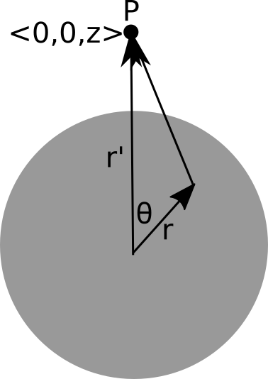
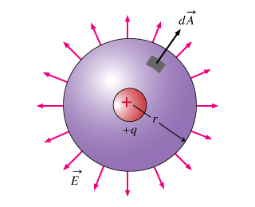
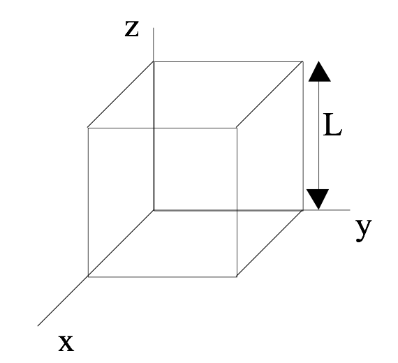
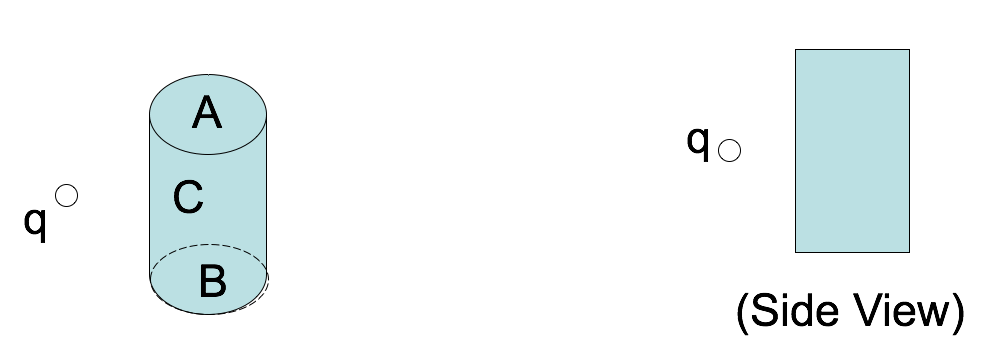
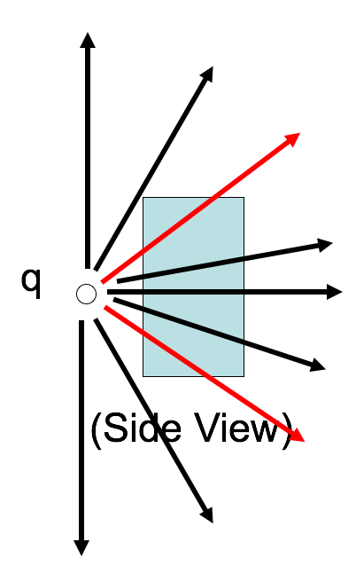
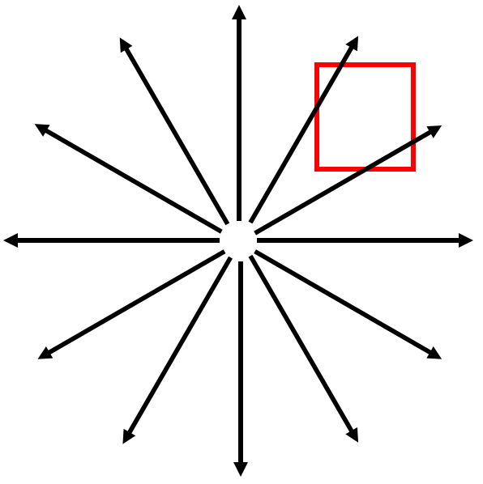

<section data-markdown>

What do you expect to happen to the field as you get really far from the rod?

$$E_x = \dfrac{\lambda}{4\pi\varepsilon_0\}\dfrac{L}{x\sqrt{x^2+L^2}}$$

1. $E_x$ goes to 0.
2. $E_x$ begins to look like a point charge.
3. $E_x$ goes to $\infty$.
4. More than one of these is true.
5. I can't tell what should happen to $E_x$.

Note:
CORRECT ANSWER: D (A and B)

</section>

<section data-markdown>
I spent ... hours on the second homework.

1. 1-2
2. 3-4
3. 5-6
4. 7-8
5. More than 9
</section>

<section data-markdown>
I felt ... doing the Python part of the homework.

1. relatively comfortable
2. comfortable enough
3. kind of uncomfortable
4. really uncomfortable
5. I didn't do it
</section>

<section data-markdown>

## Announcements

* Will start "counting" clickers next Monday
  - Register your clicker!
* If you need help with Python, let me know ASAP!
* Honors Option
  - Talk to me about your ideas
  - Option 1: Design a computational activity for this class
  - Option 2: Develop a computational model and paper for an interesting electrostatics phenomenon
  - Option 3: Pitch me your idea

</section>

<section data-markdown>

Taylor Series?

1. I remember those and am comfortable with them.
2. I rememeber them, but it might take a little while to get comfrtable.
3. I've definitely worked with them before, but I don't recall them.
4. I have never seen them.

</section>

<section data-markdown>

Given the location of the little bit of charge ($dq$), what is $|\vec{\mathfrak{R}}|$?

1. $\sqrt{z^2+r'^2}$
2. $\sqrt{z^2+r'^2-2zr'\cos\theta}$
3. $\sqrt{z^2+r'^2+2zr'\cos\theta}$
4. Something else

Note:
CORRECT ANSWER: B

</section>

<section data-markdown>

Which of the following are vectors?

(I) Electric field, (II) Electric flux, and/or (III) Electric charge

1. I only
2. I and II only
3. I and III only
4. II and III only
5. I, II, and II

Note:
* CORRECT ANSWER: A

</section>

<section data-markdown>

## Gauss' Law

$$\oint_S \mathbf{E}\cdot d\mathbf{A} = \int_V \dfrac{\rho}{\varepsilon_0}d\tau$$

</section>

<section data-markdown>

The space in and around a cubical box (edge length $L$) is filled with a constant uniform electric field, $\mathbf{E} = E_0 \hat{y}$. What is the TOTAL electric flux $\oint_S \mathbf{E} \cdot d\mathbf{A}$ through this closed surface?

1. 0
2. $E_0L^2$
3. $2E_0L^2$
4. $6E_0L^2$
5. We don't know $\rho(r)$, so can't answer.

Note:
* CORRECT ANSWER: A
* All the incoming flux on the left side comes out the right side

</section>

<section data-markdown>
A positive point charge $+q$ is placed outside a closed cylindrical surface as shown.  The closed surface consists of the flat end caps (labeled A and B) and the curved side surface (C). What is the sign of the electric flux through surface C?

1. positive
2. negative
3. zero
4. not enough information given to decide

Note:
* CORRECT ANSWER: B
* This is meant to be hard to visualize, next slide illustrates it better.

</section>

<section data-markdown>

Let's get a better look at the side view.

</section>

<section data-markdown>
A positive point charge $+q$ is placed outside a closed cylindrical surface as shown.  The closed surface consists of the flat end caps (labeled A and B) and the curved side surface (C). What is the sign of the electric flux through surface C?

1. positive
2. negative
3. zero
4. not enough information given to decide

Note:
* CORRECT ANSWER: B
* Some of the incoming flux through C goes out A and B.

</section>

<section data-markdown>

Which of the following two fields has zero divergence?

| I | II |
|:-:|:-:|
|  |  |

1. Both do.
2. Only I is zero
3. Only II is zero
4. Neither is zero
5. ???

Note:
* CORRECT ANSWER: B
* Think about dE/dx and dE/dy
* Fall 2016: 7 [34] 13 43 3; (Asked them to consider dvx/dx and dvy/dy) 3 [90] 3 4 0

</section>

<section data-markdown>

What is the divergence in the boxed region?

1. Zero
2. Not zero
3. ???

Note:
* CORRECT ANSWER: A
* Lines in; lines out - harder to see dE/dx and dE/dy
* One of those curious ones where the 2D picture might get in the way; think 3D

</section>

<section data-markdown>

**Activity:** For a the electric field of a point charge, $\mathbf{E}(\mathbf{r}) = \dfrac{1}{4\pi\varepsilon_0}\dfrac{q}{r^2}\hat{r}$, compute $\nabla \cdot \mathbf{E}$.

*Hint: The front fly leaf of Griffiths suggests that the we take:*
$$\dfrac{1}{r^2}\dfrac{\partial}{\partial r}\left(r^2 E_r\right)$$

Note:
* You get zero! Motivates delta function

</section>

<section data-markdown>

Remember this?

</section>

<section data-markdown>

What is the value of:

$$\int_{-\infty}^{\infty} x^2 \delta(x-2)dx$$

1. 0
2. 2
3. 4
4. $\infty$
5. Something else

Note:
* CORRECT ANSWER: C

</section>

<section data-markdown>

**Activity**: Compute the following integrals. Note anything special you had to do.

* Row 1-2: $\int_{-\infty}^{\infty} xe^x \delta(x-1)dx$
* Row 3-4: $\int_{\infty}^{-\infty} \log(x) \delta(x-2)dx$
* Row 5-6: $\int_{-\infty}^{0} xe^x \delta(x-1)dx$
* Row 6+: $\int_{-\infty}^{\infty} (x+1)^2 \delta(4x)dx$

Note:
* Give them 2-3 minutes to work on it and ask for what they did.

</section>
