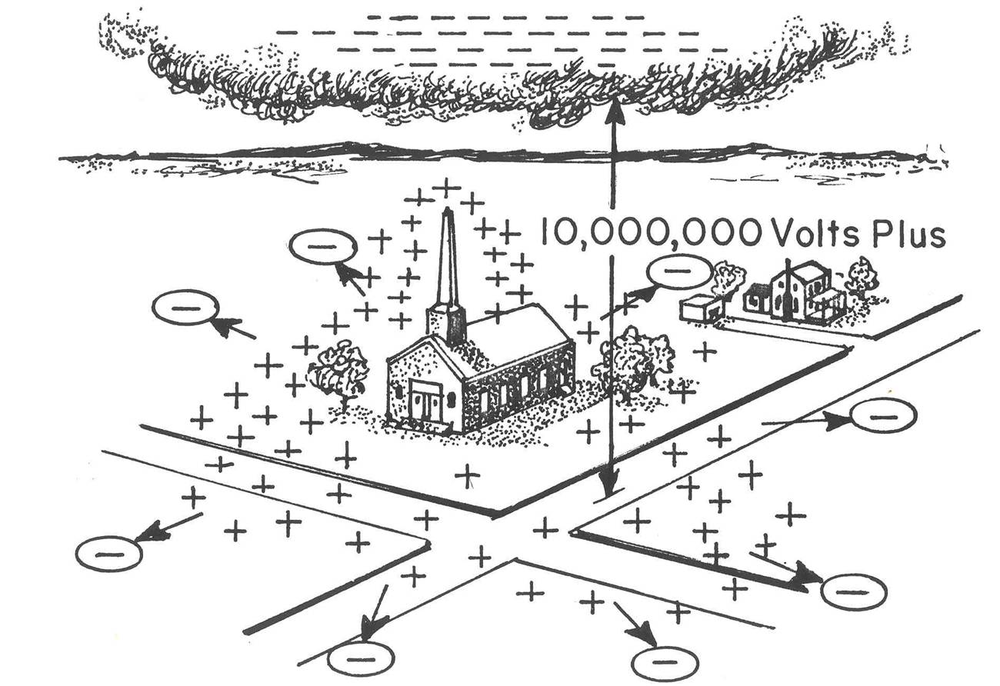

<section data-markdown>

What is the total charge for this distribution?

$$\rho(\mathbf{r}) = \sum_{k=0}^2 (1+k)\,q\,\delta^3(\mathbf{r}-k\mathbf{a})$$

1. q
2. 2 q
3. 4 q
4. 6 q
5. Something else

Note:
* Correct Answer: D (write it out)
* Follow up what does it look like?

</section>

<section data-markdown>

## Announcements

* As requested, Homework 2 grading rubric posted
* Exam 1 is coming up! October 4th (More details next week!)

</section>

<section data-markdown>

A Gaussian surface which is *not* a sphere has a single charge (q) inside it, *not* at the center. There are more charges outside. What can we say about total electric flux through this surface $\oint_S \mathbf{E} \cdot d\mathbf{A}$?

1. It is $q/\varepsilon_0$.
2. We know what it is, but it is NOT $q/\varepsilon_0$.
3. Need more info/details to figure it out.

Note:
* CORRECT ANSWER: A

</section>

<section data-markdown>

An electric dipole ($+q$ and $–q$, small distance $d$ apart) sits centered in a Gaussian sphere.

What can you say about the flux of $\mathbf{E}$ through the sphere, and $|\mathbf{E}|$ on the sphere?

1. Flux = 0, E = 0 everywhere on sphere surface
2. Flux = 0, E need not be zero *everywhere* on sphere
3. Flux is not zero, E = 0 everywhere on sphere
4. Flux is not zero, E need not be zero...

Note:
* CORRECT ANSWER: B
* Think about Q enclosed; what can we say about E though?

</section>

<section data-markdown>

*Tutorial follow-up*:

Does the charge $\sigma$ on the beam line affect the particles being accelerated inside it?

1. Yes
2. No
3. ???

*Think: Why? Or why not?*

Note:
* CORRECT ANSWER: B
* There's no field inside
</section>

<section data-markdown>

*Tutorial follow-up*:

Could the charge $\sigma$ affect the electronic equipment outside the tunnel?

1. Yes
2. No
3. ???

*Think: Why? Or why not?*

Note:
* CORRECT ANSWER: A
* Definitely a field outside

</section>

<section data-markdown>

We derived that the electric field due to an infinite sheet with charge density $\sigma$ was as follows:

$$\mathbf{E}(z) = \begin{cases} \dfrac{\sigma}{2\varepsilon_0}\hat{k} & \mbox{if} & \mbox{ z > 0} \cr \dfrac{-\sigma}{2\varepsilon_0}\hat{k} & \mbox{if} & \mbox{ z < 0}\end{cases}$$

What does that tell you about the difference in the field when we cross the sheet, $\mathbf{E}(+z)-\mathbf{E}(-z)$?

1. it's zero
2. it's $\frac{\sigma}{\varepsilon_0}$
3. it's -$\frac{\sigma}{\varepsilon_0}$
4. it's +$\frac{\sigma}{\varepsilon_0} \hat{k}$
5. it's -$\frac{\sigma}{\varepsilon_0} \hat{k}$

Note:
* CORRECT ANSWER: D
* Makes for a good discussion about cross one direction versus the other

</section>

<section data-markdown>

## Electric Potential

</section>

<section data-markdown>

Which of the following two fields has zero curl?

| I | II |
|:-:|:-:|
|  |  |

1. Both do.
2. Only I is zero
3. Only II is zero
4. Neither is zero
5. ???

Note:
* CORRECT ANSWER: C
* Think about paddle wheel
* Fall 2016: 9 0 [89] 3 0
</section>

<section data-markdown>

What is the curl of the vector field, $\mathbf{v}= c\hat{\phi}$, in the region shown below?

1. non-zero everywhere
2. zero at some points, non-zero at others
3. zero curl everywhere

Note:
* CORRECT ANSWER: A

</section>

<section data-markdown>

What is the curl of this vector field, in the red region shown below?

1. non-zero everywhere in the box
2. non-zero at a limited set of points
3. zero curl everywhere shown
4. we need a formula to decide

Note:
* CORRECT ANSWER: D
* I think it's D because it depends on how the field drops off, which we haven't indicated. If it's drops off like 1/r, then it has no curl.
</section>

<section data-markdown>

What is the curl of this vector field, $\mathbf{v} = \dfrac{c}{s}\hat{\phi}$, in the red region shown below?

1. non-zero everywhere in the box
2. non-zero at a limited set of points
3. zero curl everywhere shown

</section>

<section data-markdown>

Is it mathematically ok to do this?

$$\mathbf{E} = \dfrac{1}{4\pi\varepsilon_0}\int_V\rho(\mathbf{r}')d\tau'\left(-\nabla\dfrac{1}{\mathfrak{R}}\right)$$

$$\longrightarrow \mathbf{E} =-\nabla\left( \dfrac{1}{4\pi\varepsilon_0}\int_V\rho(\mathbf{r}')d\tau'\dfrac{1}{\mathfrak{R}}\right)$$

1. Yes
2. No
3. ???
</section>

<section data-markdown>

If $\nabla \times \mathbf{E} = 0$, then $\oint_C \mathbf{E} \cdot d\mathbf{l} =$

1. 0
2. something finite
3. $\infty$
4. Can't tell without knowing $C$

</section>

<section data-markdown>

Can superposition be applied to electric potential, $V$?

$$V_{tot} \stackrel{?}{=} \sum_i V_i = V_1 +V_2 + V_3 + \dots$$

1. Yes
2. No
3. Sometimes

Note:
As long as the zero potential is the same for all measurements.

</section>
