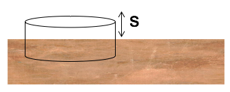

<section data-markdown>

Does system energy "superpose"?

That is, if you have one system of charges with total stored energy $W_1$, and a second charge distribution with $W_2$...if you superpose these charge distributions, is the total energy of the new system simply $W_1 + W_2$?

1. Yes
2. No

Note:
* CORRECT ANSWER: B
* Draw 4 charges and show that it is not the sum of the 2 charges and the other 2.

</section>

<section data-markdown>

## Announcements
* Homework 5 has a partner problem
  - Review problem that you share with each other
  - Can share on Piazza (for extra credit!)

* Exam 1 is Wednesday (7-9pm in A149 PSS)
</section>

<section data-markdown>

Two charges, $+q$ and $-q$, are a distance $r$ apart.  As the charges are slowly moved together, the total field energy

$$\dfrac{\varepsilon_0}{2}\int E^2 d\tau$$

1. increases
2. decreases
3. remains constant

Note:
* CORRECT ANSWER: B
* Consider when they overlap, field goes to zero, must be E gets smaller as they get closer. same volume
</section>

<section data-markdown>

A parallel-plate capacitor has $+Q$ on one plate, $-Q$ on the other.  The plates are isolated so the charge $Q$ cannot change.  As the plates are pulled apart, the total electrostatic energy stored in the capacitor:

1. increases
2. decreases
3. remains constant.

Note:
* CORRECT ANSWER: A
* Same E; constant; larger volume where it is non-zero
</section>

<section data-markdown>

### Conductors

</section>

<section data-markdown>

### The conductor problem

</section>

<section data-markdown>

A point charge $+q$ sits outside a **solid neutral conducting copper sphere** of radius $A$. The charge q is a distance $r > A$ from the center, on the right side. What is the E-field at the center of the sphere? (Assume equilibrium situation).

1. $|E| = kq/r^2$, to left
2. $kq/r^2 > |E| > 0$, to left
3. $|E| > 0$, to right
4. $E = 0$
5. None of these

Note:
* CORRECT ANSWER: D
* Net electric field inside of a metal in static equilibrium is zero
* Talk about the net field versus the field due to the charges on the metal.

</section>

<section data-markdown>

In the previous question, suppose **the copper sphere is charged**, total charge $+Q$. (We are still in static equilibrium.) What is now the magnitude of the E-field at the center of the sphere?

1. $|E| = kq/r^2$
2. $|E| = kQ/A^2$
3. $|E| = k(q-Q)/r^2$
4. $|E| = 0$
5. None of these! / it’s hard to compute

Note:
* CORRECT ANSWER: D
* Talk about the net field versus the field due to the charges on the metal.
</section>

<section data-markdown>

We have a large copper plate with uniform surface charge density, $\sigma$.
Imagine the Gaussian surface drawn below.  Calculate the E-field a small distance $s$ above the conductor surface.

1. $|E| = \frac{\sigma}{\varepsilon_0}$
2. $|E| = \frac{\sigma}{2\varepsilon_0}$
3. $|E| = \frac{\sigma}{4\varepsilon_0}$
4. $|E| = \frac{1}{4\pi\varepsilon_0}\frac{\sigma}{s^2}$
5. $|E| = 0$

Note:
* CORRECT ANSWER: A
* Might have to do derivation and go through details of infinitely thin line charge. Must be +sigma on other side, btw.

</section>
