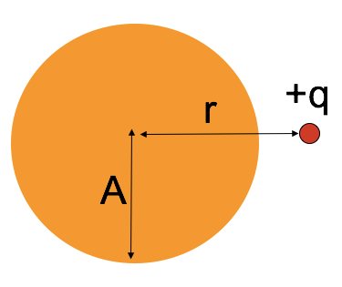
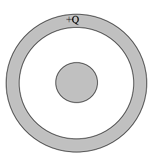
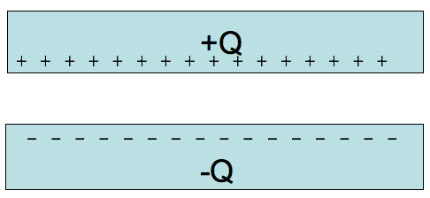
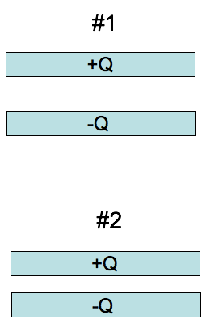
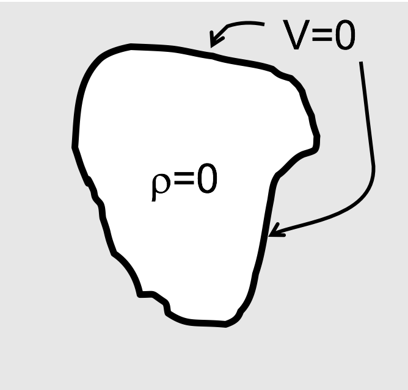

<section data-markdown>

A point charge $+q$ sits outside a **solid neutral conducting copper sphere** of radius $A$. The charge q is a distance $r > A$ from the center, on the right side. What is the E-field at the center of the sphere? (Assume equilibrium situation).

1. $|E| = kq/r^2$, to left
2. $kq/r^2 > |E| > 0$, to left
3. $|E| > 0$, to right
4. $E = 0$
5. None of these

Note:
* CORRECT ANSWER: D
* Net electric field inside of a metal in static equilibrium is zero
* Talk about the net field versus the field due to the charges on the metal.

</section>

<section data-markdown>

### Announcements

* Test on Wednesday (7-9pm)
  * All Homework solutions posted on Piazza
  * You may bring in one side of a piece of paper with your own notes
* Post your review problem by Tuesday at midnight for extra credit
  - 10 bonus points on HW 5

</section>

<section data-markdown>

In the previous question, suppose **the copper sphere is charged**, total charge $+Q$. (We are still in static equilibrium.) What is now the magnitude of the E-field at the center of the sphere?

1. $|E| = kq/r^2$
2. $|E| = kQ/A^2$
3. $|E| = k(q-Q)/r^2$
4. $|E| = 0$
5. None of these! / it’s hard to compute

Note:
* CORRECT ANSWER: D
* Talk about the net field versus the field due to the charges on the metal.
</section>

<section data-markdown>

We have a large copper plate with uniform surface charge density, $\sigma$.
Imagine the Gaussian surface drawn below.  Calculate the E-field a small distance $s$ above the conductor surface.

1. $|E| = \frac{\sigma}{\varepsilon_0}$
2. $|E| = \frac{\sigma}{2\varepsilon_0}$
3. $|E| = \frac{\sigma}{4\varepsilon_0}$
4. $|E| = \frac{1}{4\pi\varepsilon_0}\frac{\sigma}{s^2}$
5. $|E| = 0$

Note:
* CORRECT ANSWER: A
* Might have to do derivation and go through details of infinitely thin line charge. Must be +sigma on other side, btw.

</section>

<section data-markdown>

Consider a long coaxial with charge $+Q$ placed on the inside metal wire and $-Q$ outside metal sheath as shown.

Sketch the distribution of charge in this situtation using plus signs to represent positive chages and minus signs to represent negative charges.

Note:
* Ask them for answers, put up on board and turn into clicker question
* Answer should be plusses on outside of inner and minuses inside of outer (equal numbers)

</section>

<section data-markdown>

If you were calculating the potential difference, $\Delta V$, between the center of the inner conductor ($s=0$) and infinitely far away ($s \rightarrow \infty$), what regions of space would have a (non-zero) contribution to your calculation?

1. $s<a$
2. $a<s<b$
3. $b<s<c$
4. $s>c$
5. More than one of these

Note:
* Correct answer: E
* Should be where the metal is

</section>

<section data-markdown>

Now, draw the charge distribution (little + and – signs) if the inner conductor has a total charge $+Q$ on it, and the outer conductor is electrically neutral.

Note:
* Ask them for answers, put up on board and turn into clicker question
* Answer should be plusses on outside of inner and minuses inside of outer and plusses on outside of outer (equal numbers)

</section>

<section data-markdown>

Consider how the charge distribution would change if the inner conductor is shifted off-center, but still has $+Q$ on it, and the outer conductor remains electrically neutral. Draw the new charge distribution (little + and – signs) and be precise about how you know.

Note:
* Ask them for answers, put up on board and turn into clicker question
* Answer should be plusses on outside of inner and minuses inside of outer and plusses on outside of outer (equal numbers); shift only on outside of inner and inside of outer (no net field from them)

</section>

<section data-markdown>

Return the inner conductor to the center.

Instead of the total charge $+Q$ being on the inner conductor, sketch the charge distribution (little + and – signs) if the outer conductor has a total charge $+Q$ on it, and the inner conductor is electrically neutral. Be precise about exactly where the charge will be on these conductors, and how you know.

Note:
* Ask them for answers, put up on board and turn into clicker question
* Answer should be plusses on outside of outer; nothing else.

</section>

<section data-markdown>

A neutral copper sphere has a spherical hollow in the center.  A charge $+q$ is placed in the center of the hollow.  What is the total charge on the outside surface of the copper sphere? (Assume Electrostatic equilibrium.)

1. Zero
2. $-q$
3. $+q$
4. $0 < q_{outer} < +q$
5. $-q < q_{outer} < 0$

</section>

<section data-markdown>

A long coax has total charge $+Q$ on the OUTER conductor. The INNER conductor is neutral.

What is the sign of the potential difference, $\Delta V = V(c)-V(0)$, between the center of the inner conductor ($s = 0$)
and the outside of the outer conductor?

1. Positive
2. Negative
3. Zero

Note:
* CORRECT ANSWER: C

</section>

<section data-markdown>

Given a pair of very large, flat, conducting capacitor plates with total charges $+Q$ and $-Q$. Ignoring edges, what is the equilibrium distribution of the charge?

1. Throughout each plate
2. Uniformly on both side of each plate
3. Uniformly on top of $+Q$ plate and bottom of $–Q$ plate
4. Uniformly on bottom of $+Q$ plate and top of $–Q$ plate
5. Something else

Note:
* CORRECT ANSWER: D

</section>

<section data-markdown>

Given a pair of very large, flat, conducting capacitor plates with surface charge densities $+/-\sigma$, what is the E field in the region between the plates?

1. $\sigma/2\varepsilon_0$
2. $\sigma/\varepsilon_0$
3. $2\sigma/\varepsilon_0$
4. $4\sigma/\varepsilon_0$
5. Something else

Note:
* CORRECT ANSWER: B

</section>

<section data-markdown>

You have two very large parallel plate capacitors, both with the same area and the same charge $Q$.
Capacitor \#1 has twice the gap of Capacitor \#2. Which has more stored potential energy?

1. \#1 has twice the stored energy
2. \#1 has more than twice
3. They both have the same
4. \#2 has twice the stored energy
5. \#2 has more than twice.

Note:
* CORRECT ANSWER: A
* E same; twice volume

</section>

<section data-markdown>

A parallel plate capacitor is attached to a battery which maintains a constant voltage difference V between the capacitor plates.  While the battery is attached, the plates are pulled apart. The electrostatic energy stored in the capacitor

1. increases.
2. decreases.
3. stays constant.

Note:
* CORRECT ANSWER: B
* Potential same; field is reduced; but shows up squared while d is increased, overall goes down
</section>

<section data-markdown>

### Laplace's Equation

</section>

<section data-markdown>

A region of space contains no charges. What can I say about V in the interior?

1. Not much, there are lots of possibilities for V(r) in there
2. V(r)=0 everywhere in the interior.
3. V(r)=constant everywhere in the interior

Note:
* CORRECT ANSWER: A

</section>

<section data-markdown>

A region of space contains no charges. The boundary has V=0 everywhere.
What can I say about V in the interior?

1. Not much, there are lots of possibilities for V(r) in there
2. V(r)=0 everywhere in the interior.
3. V(r)=constant everywhere in the interior

Note:
* CORRECT ANSWER: B

</section>
