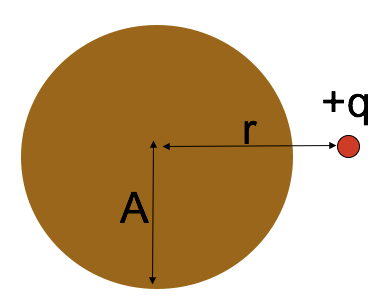

<section data-markdown>

A point charge $+q$ sits outside a **solid neutral conducting copper sphere** of radius $A$. The charge q is a distance $r > A$ from the center, on the right side. What is the E-field at the center of the sphere? (Assume equilibrium situation).

1. $|E| = kq/r^2$, to left
2. $kq/r^2 > |E| > 0$, to left
3. $|E| > 0$, to right
4. $E = 0$
5. None of these

Note:
* CORRECT ANSWER: D
* Net electric field inside of a metal in static equilibrium is zero
* Talk about the net field versus the field due to the charges on the metal.

</section>

<section data-markdown>

In the previous question, suppose **the copper sphere is charged**, total charge $+Q$. (We are still in static equilibrium.) What is now the magnitude of the E-field at the center of the sphere?

1. $|E| = kq/r^2$
2. $|E| = kQ/A^2$
3. $|E| = k(q-Q)/r^2$
4. $|E| = 0$
5. None of these! / it’s hard to compute

Note:
* CORRECT ANSWER: D
* Talk about the net field versus the field due to the charges on the metal.
</section>

<section data-markdown>

We have a large copper plate with uniform surface charge density, $\sigma$.
Imagine the Gaussian surface drawn below.  Calculate the E-field a small distance $s$ above the conductor surface.

1. $|E| = \frac{\sigma}{\varepsilon_0}$
2. $|E| = \frac{\sigma}{2\varepsilon_0}$
3. $|E| = \frac{\sigma}{4\varepsilon_0}$
4. $|E| = \frac{1}{4\pi\varepsilon_0}\frac{\sigma}{s^2}$
5. $|E| = 0$

Note:
* CORRECT ANSWER: A
* Might have to do derivation and go through details of infinitely thin line charge. Must be +sigma on other side, btw.

</section>
