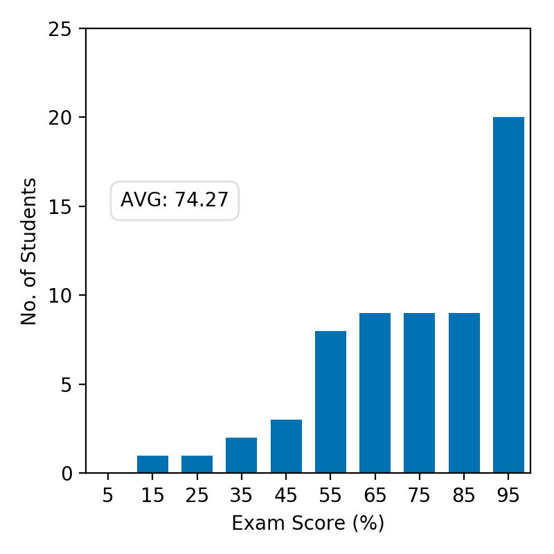
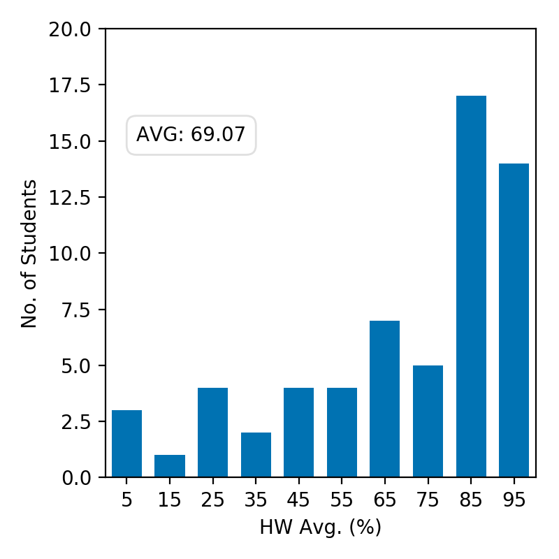
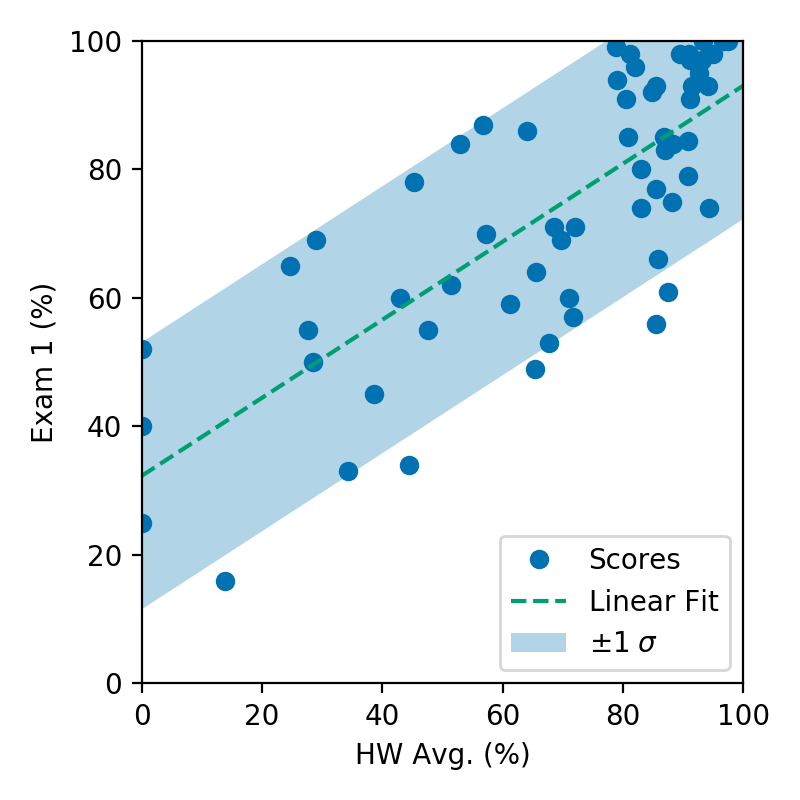

<section data-markdown>

The Method of Relaxation also works for Poission's equation (i.e., when there is charge!).

Given, $\nabla^2 V \approx \dfrac{V(x+a)-2V(x)+V(x-a)}{a^2}$

Which equations describes the appropriate "averaging" that we must do:

1. $V(x) = \dfrac{1}{2}(V(x+a)-V(x-a))$
2. $V(x) = \dfrac{\rho}{\varepsilon_0}+\dfrac{1}{2}(V(x+a)-V(x-a))$
3. $V(x) = \dfrac{a^2\rho}{2\varepsilon_0}+\dfrac{1}{2}(V(x+a)-V(x-a))$
4. Something else

</section>

<section data-markdown>

## Announcements

* Exam 1 is graded
  - Should have received email this morning with updated grades
* Danny out of town Friday
  - Norman Birge will substitute

</section>

<section data-markdown>

### Exam 1 Grades

</section>

<section data-markdown>

### Homework Averages

</section>

<section data-markdown>

### Please do your homework

</section>

<section data-markdown>

### Separation of Variables (Cartesian)

</section>

<section data-markdown>

Say you have three functions $f(x)$, $g(y)$, and $h(z)$.
$f(x)$  depends on $x$ but not on $y$ or $z$.
$g(y)$ depends on $y$ but not on $x$ or $z$.
$h(z)$ depends on $z$ but not on $x$ or $y$.

If $f(x) + g(y) + h(z) = 0$ for all $x$, $y$, $z$, then:

1. All three functions are constants (i.e. they do not depend on $x$, $y$, $z$ at all.)
2. At least one of these functions has to be zero everywhere.
3. All of these functions have to be zero everywhere.
4. All three functions have to be linear functions in $x$, $y$, or $z$ respectively (such as $f(x)=ax+b$)

Note:
* CORRECT ANSWER: A

</section>

<section data-markdown>

If our general solution contains the function,

$$X(x) = Ae^{\sqrt{c}x} + Be^{-\sqrt{c}x}$$

What does our solution look like if $c<0$; what about if $c>0$?

1. Exponential; Sinusoidal
2. Sinusoidal; Exponential
3. Both Exponential
4. Both Sinusoidal
5. ???

Note:
* CORRECT ANSWER: B

</section>

<section data-markdown>

Our example problem has the following boundary conditions:

* $V(0,y>0) = 0; V(a,y>0) = 0$
* $V(x_{0\rightarrow a},y=0) = V_0; V(x,y\rightarrow \infty) = 0$

If $X''= c_1 X$ and $Y'' = c_2Y$ with $c_1 + c_2 = 0$, which is constant is positive?

1. $c_1$
2. $c_2$
3. It doesn't matter either can be

Note:
* CORRECT ANSWER: B
</section>

<section data-markdown>

Given the two diff. eq's :

$$\dfrac{1}{X}\dfrac{d^2X}{dx^2} = C_1 \qquad \dfrac{1}{Y}\dfrac{d^2Y}{dy^2} = C_2$$

where $C_1+C_2 = 0$.  Given the boundary conditions in the figure, which coordinate should be assigned to the negative constant (and thus the sinusoidal solutions)?

1. x
2. y
3. $C_1 = C_2 = 0$ here
4. It doesn't matter.

Note:
* CORRECT ANSWER: B
</section>

<section data-markdown>

Given the two diff. eq's :

$$\dfrac{1}{X}\dfrac{d^2X}{dx^2} = C_1 \qquad \dfrac{1}{Y}\dfrac{d^2Y}{dy^2} = C_2$$

where $C_1+C_2 = 0$.  Given the boundary conditions in the figure, which coordinate should be assigned to the negative constant (and thus the sinusoidal solutions)?

1. x
2. y
3. $C_1 = C_2 = 0$ here
4. It doesn't matter.

Note:
* CORRECT ANSWER: C
* It's constant throughout!
</section>

<section data-markdown>

When does $\sin(ka)e^{-ky}$ vanish?

1. $k = 0$
2. $k = \pi/(2a)$
3. $k = \pi/a$
4. A and C
5. A, B, C

Note:
* CORRECT ANSWER: D

</section>

<section data-markdown>

Suppose $V_1(r)$ and $V_2(r)$ are linearly independent functions which both solve Laplace's equation, $\nabla^2 V = 0$.

Does $aV_1(r)+bV_2(r)$ also solve it (with $a$ and $b$ constants)?

1. Yes. The Laplacian is a linear operator
2. No. The uniqueness theorem says this scenario is impossible, there are never two independent solutions!
3. It is a definite yes or no, but the reasons given above just aren't right!
4. It depends...

Note:
* CORRECT ANSWER: A

</section>

<section data-markdown>

What is the value of $\int_0^{2\pi} \sin(2x)\sin(3x)\;dx$ ?

1. Zero
2. $\pi$
3. $2 \pi$
4. other
5. I need resources to do an integral like this!

Note:
* CORRECT ANSWER: A
* Orthogonal functions!

</section>

<section data-markdown>

### Exact Solutions:

$$V(x,y) = \sum_{n=1}^{\infty} \dfrac{4V_0}{n\pi}\dfrac{1}{\cosh\left(\frac{n\pi}{2}\right)}\cosh\left(\frac{n\pi x}{a}\right)\sin\left(\frac{n \pi y}{a}\right)$$

### Approximate Solutions:
### (1 term; 20 terms)

</section>

<section data-markdown>

### Separation of Variables (Spherical)

</section>

<section data-markdown>

Given $\nabla^2 V = 0$ in Cartesian coords, we separated $V(x,y,z) = X(x)Y(y)Z(z)$. Will this approach work in spherical coordinates, i.e. can we separate $V(r,\theta,\phi) = R(r)\Theta(\theta)\Phi(\phi)$?

1. Sure.
2. Not quite - the angular components cannot be isolated, e.g., $f(r,\theta,\phi) = R(r)Y(\theta,\phi)$
3. It won't work at all because the spherical form of Laplace's Equation has cross terms in it (see the front cover of Griffiths)

Note:
* CORRECT ANSWER: A

</section>
