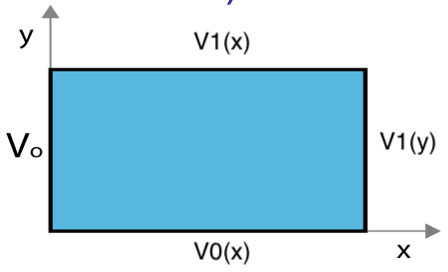
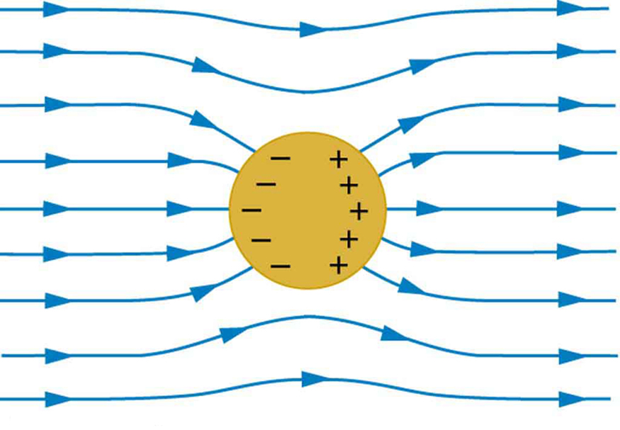

<section data-markdown>

Given the two diff. eq's :

$$\dfrac{1}{X}\dfrac{d^2X}{dx^2} = C_1 \qquad \dfrac{1}{Y}\dfrac{d^2Y}{dy^2} = C_2$$

where $C_1+C_2 = 0$.  Given the boundary conditions in the figure, which coordinate should be assigned to the negative constant (and thus the sinusoidal solutions)?

1. x
2. y
3. $C_1 = C_2 = 0$ here
4. It doesn't matter.
5. I don't know.

Note:
* CORRECT ANSWER: E
* It will depend, and sometimes separation of variables will not work!
</section>

<section data-markdown>

</section>

<section data-markdown>

### Exact Solutions:

$$V(x,y) = \sum_{n=1}^{\infty} \dfrac{4V_0}{n\pi}\dfrac{1}{\cosh\left(\frac{n\pi}{2}\right)}\cosh\left(\frac{n\pi x}{a}\right)\sin\left(\frac{n \pi y}{a}\right)$$

### Approximate Solutions:
### (1 term; 20 terms)

</section>

<section data-markdown>

Given that we want to solve Laplace's equation in 2D and that we have a description for the numerical second derivative of one variable,

$$f''(x) \approx \dfrac{f(x+a)-2f(x)+f(x-a)}{a^2}$$

what is the appropriate numerical partial derivative for $V(x,y)$, $\partial V/\partial x \approx$,

1. $$\left[V(x+a) - 2V(x) + V(x-a)\right]/a^2$$
2. $$\left[V(x+a,y) - 2V(x,y) + V(x-a,y)\right]/a^2$$
3. $$\left[V(y+a) - 2V(y) + V(y-a)\right]/a^2$$
4. $$\left[V(x,y+a) - 2V(x,y) + V(x,y-a)\right]/a^2$$
5. More than one is correct

Note:
* Correct answer: B is correct

</section>

<section data-markdown>

Given that the potential at any point is given by the average of the surrounding points,

$$V(x,y) \approx \dfrac{1}{4}[ V(x+a,y) + V(x,y+a)$$
$$ +V(x-a,y) + V(x,y-a)]$$

Draft the psuedocode for finding the approximate potential.

</section>

<section data-markdown>

### Separation of Variables (Spherical)

</section>

<section data-markdown>

Given $\nabla^2 V = 0$ in Cartesian coords, we separated $V(x,y,z) = X(x)Y(y)Z(z)$. Will this approach work in spherical coordinates, i.e. can we separate $V(r,\theta,\phi) = R(r)\Theta(\theta)\Phi(\phi)$?

1. Sure.
2. Not quite - the angular components cannot be isolated, e.g., $f(r,\theta,\phi) = R(r)Y(\theta,\phi)$
3. It won't work at all because the spherical form of Laplace's Equation has cross terms in it (see the front cover of Griffiths)

Note:
* CORRECT ANSWER: A

</section>

<section data-markdown>

$$V(r,\theta) = \sum_{l=0}^{\infty} \left(A_l r^l + \dfrac{B_l}{r^{l+1}}\right)P_l(\cos \theta)$$

V everywhere on a spherical shell is a given constant, i.e. $V(R,\theta) = V_0$. There are no charges inside the sphere. Which terms do you expect to appear when finding V(inside)?

1. Many $A_l$ terms (but no $B_l$'s)
2. Many $B_l$ terms (but no $A_l$'s)
3. Just $A_0$
4. Just $B_0$
5. Something else!

Note:
* CORRECT ANSWER: C

</section>

<section data-markdown>

The general solution for the electric potential in spherical coordinates with azimuthal symmetry (no $\phi$ dependence) is:

$$V(r,\theta) = \sum_{l=0}^{\infty} \left(A_l r^l + \dfrac{B_l}{r^{l+1}}\right)P_l(\cos \theta)$$

Consider a metal sphere (constant potential in and on the sphere, remember). Which terms in the sum vanish outside the sphere? (Recall: $V \rightarrow 0$ as $r \rightarrow \infty$)

1. All the $A_l$'s
2. All the $A_l$'s except $A_0$
3. All the $B_l$'s
4. All the $B_l$'s except $B_0$
5. Something else

Note:
* CORRECT ANSWER: E
* Only B0 will survive.

</section>

<section data-markdown>

Given $V_0(\theta) = \sum_l C_l P_l(\cos \theta)$, we want to get to the integral:

$$ \int_{-1}^{+1}P_l(u)\;P_m(u)\;du = \dfrac{2}{2+1}\; (\mathrm{for}\;l=m)$$

we can do this by multiplying both sides by:

1. $P_m(\cos \theta)$
2. $P_m(\sin \theta)$
3. $P_m(\cos \theta) \sin \theta$
4. $P_m(\sin \theta) \cos \theta$
5. $P_m(\sin \theta) \sin \theta$

Note:
* CORRECT ANSWER: D

</section>

<section data-markdown>

$$V(r,\theta) = \sum_{l=0}^{\infty} \left(A_l r^l + \dfrac{B_l}{r^{l+1}}\right)P_l(\cos \theta)$$

Suppose V on a spherical shell is:

$$V(R,\theta) = V_0 \left(1+\cos^2\theta\right)$$

Which terms do you expect to appear when finding **V(inside)**?
1. Many $A_l$ terms (but no $B_l$'s)
2. Many $B_l$ terms (but no $A_l$'s)
3. Just $A_0$ and $A_2$
4. Just $B_0$ and $B_2$
5. Something else!

Note:
* CORRECT ANSWER: C

</section>

<section data-markdown>

$$V(r,\theta) = \sum_{l=0}^{\infty} \left(A_l r^l + \dfrac{B_l}{r^{l+1}}\right)P_l(\cos \theta)$$

Suppose V on a spherical shell is:

$$V(R,\theta) = V_0 \left(1+\cos^2\theta\right)$$

Which terms do you expect to appear when finding **V(outside)**?
1. Many $A_l$ terms (but no $B_l$'s)
2. Many $B_l$ terms (but no $A_l$'s)
3. Just $A_0$ and $A_2$
4. Just $B_0$ and $B_2$
5. Something else!

Note:
* CORRECT ANSWER: D

</section>

<section data-markdown>

How many boundary conditions (on the potential $V$) do you use to find $V$ inside the spherical plastic shell?

1. 1
2. 2
3. 3
4. 4
5. It depends on $V_0(\theta)$

Note:
* CORRECT ANSWER: B
* Good for discussion; obviously you need the surface BC, but what about at r=0? Is that technically a BC?
</section>
