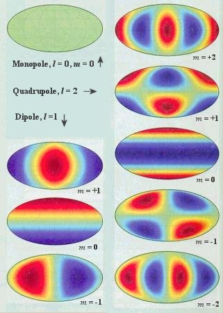
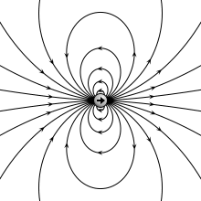
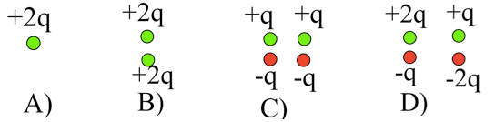
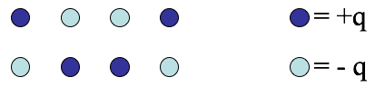

<section data-markdown>

How many boundary conditions (on the potential $V$) do you use to find $V$ inside the spherical plastic shell?

1. 1
2. 2
3. 3
4. 4
5. It depends on $V_0(\theta)$

Note:
* CORRECT ANSWER: B
* Good for discussion; obviously you need the surface BC, but what about at r=0? Is that technically a BC?
</section>

<section data-markdown>

## Announcements

* Homework 8 has 2D relaxation problem
  - It is OK to post code on piazza and get help
  - Solution to HW7 problem 5 (1D relaxation) is linked (you may work from it)
* DC out of town Monday; Norman Birge will cover

</section>

<section data-markdown>

Two charges are positioned as shown to the left. The relative position vector between them is $\mathbf{d}$. What is the value of of the dipole moment? $\sum_i q_i \mathbf{r}_i$

1. $+q\mathbf{d}$
2. $-q\mathbf{d}$
3. Zero
4. None of these

Note:
* CORRECT ANSWER: A

</section>

<section data-markdown>

## Multipole Expansion

Multipole Expansion of the Power Spectrum of CMBR

Note: The radiation from cosmic microwave background can be described in terms of contributions using a basis of functions with increasing smaller contributions.

</section>

<section data-markdown>

Two charges are positioned as shown to the left. The relative position vector between them is $\mathbf{d}$. What is the dipole moment of this configuration?

$$\sum_i q_i \mathbf{r}_i$$

1. $+q\mathbf{d}$
2. $-q\mathbf{d}$
3. Zero
4. None of these; it's more complicated than before!

Note:
* CORRECT ANSWER: A

</section>

<section data-markdown>

For a dipole at the origin pointing in the z-direction, we have derived:

$$\mathbf{E}_{dip}(\mathbf{r}) = \dfrac{p}{4 \pi \varepsilon_0 r^3}\left(2 \cos \theta\;\hat{\mathbf{r}} + \sin \theta\;\hat{\mathbf{\theta}}\right)$$

For the dipole $\mathbf{p} = q\mathbf{d}$ shown, what does the formula predict for the direction of $\mathbf{E}(\mathbf{r}=0)$?

1. Down
2. Up
3. Some other direction
4. The formula doesn't apply

Note:
* CORRECT ANSWER: D
* The formula works far from the dipole only.

</section>

<section data-markdown>

### Ideal vs. Real dipole

</section>

<section data-markdown>

$$\mathbf{p} = \sum_i q_i \mathbf{r}_i$$

What is the magnitude of the dipole moment of this charge distribution?

1. qd
2. 2qd
3. 3qd
4. 4qd
5. It's not determined

Note:
* CORRECT ANSWER: B

</section>

<section data-markdown>

$$\mathbf{p} = \sum_i q_i \mathbf{r}_i$$

What is the dipole moment of this system?

(BTW, it is NOT overall neutral!)

1. $q\mathbf{d}$
2. $2q\mathbf{d}$
3. $\frac{3}{2}q\mathbf{d}$
4. $3q\mathbf{d}$
5. Someting else (or not defined)

Note:
* CORRECT ANSWER: B

</section>

<section data-markdown>

$$\mathbf{p} = \sum_i q_i \mathbf{r}_i$$

What is the dipole moment of this system?

(Same as last question, just shifted in $z$.)

1. $q\mathbf{d}$
2. $2q\mathbf{d}$
3. $\frac{3}{2}q\mathbf{d}$
4. $3q\mathbf{d}$
5. Someting else (or not defined)

Note:
* CORRECT ANSWER: C

</section>

<section data-markdown>

You have a physical dipole, $+q$ and $-q$ a finite distance $d$ apart. When can you use the expression:

$$V(\mathbf{r}) = \dfrac{1}{4 \pi \varepsilon_0}\dfrac{\mathbf{p}\cdot \hat{\mathbf{r}}}{r^2}$$

1. This is an exact expression everywhere.
2. It's valid for large $r$
3. It's valid for small $r$
4. No idea...

Note:
* CORRECT ANSWER: B

</section>

<section data-markdown>

You have a physical dipole, $+q$ and $-q$ a finite distance $d$ apart. When can you use the expression:

$$V(\mathbf{r}) = \dfrac{1}{4 \pi \varepsilon_0}\sum_i \dfrac{q_i}{\mathfrak{R}_i}$$

1. This is an exact expression everywhere.
2. It's valid for large $r$
3. It's valid for small $r$
4. No idea...

Note:
* CORRECT ANSWER: A

</section>

<section data-markdown>

Which charge distributions below produce a potential that looks like $\frac{C}{r^2}$ when you are far away?

E) None of these, or more than one of these!

(For any which you did not select, how DO they behave at large r?)

Note:
* CORRECT ANSWER: E (Both C and D)

</section>

<section data-markdown>

Which charge distributions below produce a potential that looks like $\frac{C}{r^2}$ when you are far away?

E) None of these, or more than one of these!

(For any which you did not select, how DO they behave at large r?)

Note:
* CORRECT ANSWER: E (Both B and D)

</section>

<section data-markdown>

In terms of the multipole expansion $V(r) = V(mono) + V(dip) + V(quad) + \dots$, the following charge distribution has the form:

1. $V(r) = V(mono) + V(dip) +\;$ higher order terms
2. $V(r) = V(dip) +\;$ higher order terms
3. $V(r) = V(dip)$
4. $V(r) =\;$ only higher order terms than dipole
5. No higher terms, $V(r) = 0$ for this one.

Note:
* CORRECT ANSWER: D

</section>
