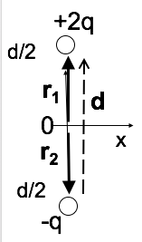

<section data-markdown>

$$\mathbf{p} = \sum_i q_i \mathbf{r}_i$$

What is the magnitude of the dipole moment of this charge distribution?

1. qd
2. 2qd
3. 3qd
4. 4qd
5. It's not determined

Note:
* CORRECT ANSWER: B

</section>

<section data-markdown>

$$\mathbf{p} = \sum_i q_i \mathbf{r}_i$$

What is the dipole moment of this system?

(BTW, it is NOT overall neutral!)

1. $q\mathbf{d}$
2. $2q\mathbf{d}$
3. $\frac{3}{2}q\mathbf{d}$
4. $3q\mathbf{d}$
5. Someting else (or not defined)

Note:
* CORRECT ANSWER: B

</section>

<section data-markdown>

$$\mathbf{p} = \sum_i q_i \mathbf{r}_i$$

What is the dipole moment of this system?

(Same as last question, just shifted in $z$.)

1. $q\mathbf{d}$
2. $2q\mathbf{d}$
3. $\frac{3}{2}q\mathbf{d}$
4. $3q\mathbf{d}$
5. Someting else (or not defined)

Note:
* CORRECT ANSWER: C

</section>

<section data-markdown>

You have a physical dipole, $+q$ and $-q$ a finite distance $d$ apart. When can you use the expression:

$$V(\mathbf{r}) = \dfrac{1}{4 \pi \varepsilon_0}\dfrac{\mathbf{p}\cdot \hat{\mathbf{r}}}{r^2}$$

1. This is an exact expression everywhere.
2. It's valid for large $r$
3. It's valid for small $r$
4. No idea...

Note:
* CORRECT ANSWER: B

</section>

<section data-markdown>

You have a physical dipole, $+q$ and $-q$ a finite distance $d$ apart. When can you use the expression:

$$V(\mathbf{r}) = \dfrac{1}{4 \pi \varepsilon_0}\sum_i \dfrac{q_i}{\mathfrak{R}_i}$$

1. This is an exact expression everywhere.
2. It's valid for large $r$
3. It's valid for small $r$
4. No idea...

Note:
* CORRECT ANSWER: A

</section>

<section data-markdown>

Which charge distributions below produce a potential that looks like $\frac{C}{r^2}$ when you are far away?

E) None of these, or more than one of these!

(For any which you did not select, how DO they behave at large r?)

Note:
* CORRECT ANSWER: E (Both C and D)

</section>

<section data-markdown>

Which charge distributions below produce a potential that looks like $\frac{C}{r^2}$ when you are far away?

E) None of these, or more than one of these!

(For any which you did not select, how DO they behave at large r?)

Note:
* CORRECT ANSWER: E (Both B and D)

</section>

<section data-markdown>

In terms of the multipole expansion $V(r) = V(mono) + V(dip) + V(quad) + \dots$, the following charge distribution has the form:

1. $V(r) = V(mono) + V(dip) +\;$ higher order terms
2. $V(r) = V(dip) +\;$ higher order terms
3. $V(r) = V(dip)$
4. $V(r) =\;$ only higher order terms than dipole
5. No higher terms, $V(r) = 0$ for this one.

Note:
* CORRECT ANSWER: D

</section>
