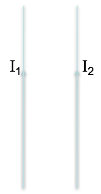

<section data-markdown>

I have two very long, parallel wires each carrying a current $I_1$ and $I_2$, respectively.  In which direction is the force on the wire with the current $I_2$?

 1. Up
 2. Down
 3. Right
 4. Left
 5. Into or out of the page

 Note:
 * CORRECT ANSWER: D

</section>
