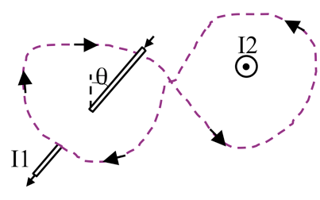

<section data-markdown>

Consider the B-field a distance z from a current sheet (flowing in the +x-direction) in the z = 0 plane. The B-field has:

1. y-component only
2. z-component only
3. y and z-components
4. x, y, and z-components
5. Other

Note:
* CORRECT ANSWER: A

</section>

<section data-markdown>

What is $\oint \mathbf{B}\cdot d\mathbf{l}$ around this purple (dashed) Amperian loop?

1. $\mu_0 (|I_2 | +|I_1 |)$
2. $\mu_0 (|I_2|-|I_1|)$
3. $\mu_0 (| I_2 | + | I_1 | \sin \theta)$
4. $\mu_0 (| I_2 | - | I_1 | \sin \theta)$
5. $\mu_0 (| I_2 | + | I_1 | \cos\theta)$

Note:
* CORRECT ANSWER: A

</section>

<section data-markdown>

An infinite solenoid with surface current density $K$ is oriented along the $z$-axis. To use Ampere's Law, we need to argue what we think $\mathbf{B}(\mathbf{r})$ depends on and which way it points.

For this solenoid, $\mathbf{B}(\mathbf{r})=$

1. $B(z)\,\hat{z}$
2. $B(z)\,\hat{\phi}$
3. $B(s)\,\hat{z}$
4. $B(s)\,\hat{\phi}$
5. Something else?
</section>

<section data-markdown>

An infinite solenoid with surface current density $K$ is oriented along the $z$-axis. Apply Ampere's Law to the rectangular imaginary loop in the $yz$ plane shown.  What does this tell you about $B_z$, the $z$-component of the B-field outside the solenoid?

1. $B_z$ is constant outside
2. $B_z$ is zero outside
3. $B_z$ is not constant outside
4. It tells you nothing about $B_z$

Note:
* CORRECT ANSWER: A

</section>

<section data-markdown>

An infinite solenoid with surface current density $K$ is oriented along the $z$-axis. Apply Ampere's Law to the rectangular imaginary loop in the $yz$ plane shown. We can safely assume that $B(s\rightarrow\infty)=0$. What does this tell you about the B-field outside the solenoid?

1. $|\mathbf{B}|$ is a small non-zero constant outside
2. $|\mathbf{B}|$ is zero outside
3. $|\mathbf{B}|$ is not constant outside
4. We still don't know anything about $|\mathbf{B}|$

Note:
* CORRECT ANSWER: B

</section>

<section data-markdown>

What do we expect $\mathbf{B}(\mathbf{r})$ to look like for the infinite sheet of current shown below?

1. $B(x)\hat{x}$
2. $B(z)\hat{x}$
3. $B(x)\hat{z}$
4. $B(z)\hat{z}$
5. Something else

Note:
* CORRECT ANSWER: C

</section>

<section data-markdown>

Which Amperian loop are useful to learn about $B(x,y,z)$ somewhere?

E. More than 1

Note:
* CORRECT ANSWER: E
* Both B and A are useful!

</section>

<section data-markdown>

Gauss' Law for magnetism, $\nabla \cdot \mathbf{B} = 0$ suggests we can generate a potential for $\mathbf{B}$. What form should the definition of this potential take ($\Phi$ and $\mathbf{A}$ are placeholder scalar and vector functions, respectively)?

1. $\mathbf{B} = \nabla \Phi$
2. $\mathbf{B} = \nabla \times \Phi$
3. $\mathbf{B} = \nabla \cdot \mathbf{A}$
4. $\mathbf{B} = \nabla \times \mathbf{A}$
5. Something else?!

Note:
* CORRECT ANSWER: D
</section>
