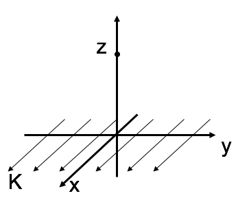

<section data-markdown>

Consider the B-field a distance z from a current sheet (flowing in the +x-direction) in the z = 0 plane. The B-field has:

1. y-component only
2. z-component only
3. y and z-components
4. x, y, and z-components
5. Other

Note:
* CORRECT ANSWER: A

</section>

<section data-markdown>
I will be in class on Wednesday.

1. Yup
2. Nope, hoss, I'll be out.

</section>

<section data-markdown>

An infinite solenoid with surface current density $K$ is oriented along the $z$-axis. To use Ampere's Law, we need to argue what we think $\mathbf{B}(\mathbf{r})$ depends on and which way it points.

For this solenoid, $\mathbf{B}(\mathbf{r})=$

1. $B(z)\,\hat{z}$
2. $B(z)\,\hat{\phi}$
3. $B(s)\,\hat{z}$
4. $B(s)\,\hat{\phi}$
5. Something else?
</section>

<section data-markdown>

An infinite solenoid with surface current density $K$ is oriented along the $z$-axis. Apply Ampere's Law to the rectangular imaginary loop in the $yz$ plane shown.  What does this tell you about $B_z$, the $z$-component of the B-field outside the solenoid?

1. $B_z$ is constant outside
2. $B_z$ is zero outside
3. $B_z$ is not constant outside
4. It tells you nothing about $B_z$

Note:
* CORRECT ANSWER: A

</section>

<section data-markdown>

An infinite solenoid with surface current density $K$ is oriented along the $z$-axis. Apply Ampere's Law to the rectangular imaginary loop in the $yz$ plane shown. We can safely assume that $B(s\rightarrow\infty)=0$. What does this tell you about the B-field outside the solenoid?

1. $|\mathbf{B}|$ is a small non-zero constant outside
2. $|\mathbf{B}|$ is zero outside
3. $|\mathbf{B}|$ is not constant outside
4. We still don't know anything about $|\mathbf{B}|$

Note:
* CORRECT ANSWER: B

</section>

<section data-markdown>

What do we expect $\mathbf{B}(\mathbf{r})$ to look like for the infinite sheet of current shown below?

1. $B(x)\hat{x}$
2. $B(z)\hat{x}$
3. $B(x)\hat{z}$
4. $B(z)\hat{z}$
5. Something else

Note:
* CORRECT ANSWER: C

</section>

<section data-markdown>

Which Amperian loop are useful to learn about $B(x,y,z)$ somewhere?

E. More than 1

Note:
* CORRECT ANSWER: E
* Both B and A are useful!

</section>

<section data-markdown>

Gauss' Law for magnetism, $\nabla \cdot \mathbf{B} = 0$ suggests we can generate a potential for $\mathbf{B}$. What form should the definition of this potential take ($\Phi$ and $\mathbf{A}$ are placeholder scalar and vector functions, respectively)?

1. $\mathbf{B} = \nabla \Phi$
2. $\mathbf{B} = \nabla \times \Phi$
3. $\mathbf{B} = \nabla \cdot \mathbf{A}$
4. $\mathbf{B} = \nabla \times \mathbf{A}$
5. Something else?!

Note:
* CORRECT ANSWER: D
</section>

<section data-markdown>

Consider a toroid, which is like a finite solenoid connected end to end. In which direction do you expect the B field to point?

1. Azimuthally ($\hat{\phi}$ direction)
2. Radially ($\hat{s}$ direction)
3. In the $\hat{z}$ direction  (perp. to page)
4. Loops around the rim
5. Mix of the above...

Note:
* CORRECT ANSWER: A

</section>

<section data-markdown>

Which Amperian loop would you draw to find B “inside” the Torus (region II)?

1. Large "azimuthal" loop
2. Smallish loop from region II to outside (where B=0)
3. Small loop in region II
4. Like A, but perp to page
5. Something entirely different

Note:
* CORRECT ANSWER: A

</section>

<section data-markdown>

With $\nabla^2 \mathbf{A} = -\mu_0 \mathbf{J}$, we can write (in Cartesian coordinates):

$$\nabla^2 A_x = -\mu_0 J_x$$

Does that also mean in spherical coordinates that $\nabla^2 A_r = -\mu_0 J_r$?

1. Yes
2. No

Note:
* CORRECT ANSWER: B

</section>

<section data-markdown>

We can compute $\mathbf{A}$ using the following integral:

$\mathbf{A}(\mathbf{r}) = \dfrac{\mu_0}{4\pi}\int \dfrac{\mathbf{J}(\mathbf{r}')}{\mathfrak{R}}d\tau'$

Can you calculate that integral using spherical coordinates?

1. Yes, no problem
2. Yes, $r'$ can be in spherical, but $\mathbf{J}$ still needs to be in Cartesian components
3. No.

Note:
* CORRECT ANSWER: B
* It's subtle. Griffiths discusses this in a footnote, you can't solve for, say, the phi component of A by integrating the "phi component" of J (because the unit vectors in spherical coordinates themselves depend on position, and get differentiated by del squared too)

</section>

<section data-markdown>

For a infinite solenoid of radius $R$, with current $I$, and $n$ turns per unit length, which is the current density $\mathbf{J}$?

1. $\mathbf{J} = nI\hat{\phi}$
2. $\mathbf{J} = nI\delta(r-R)\hat{\phi}$
3. $\mathbf{J} = \frac{I}{n}\delta(r-R)\hat{\phi}$
4. $\mathbf{J} = \mu_0 nI\delta(r-R)\hat{\phi}$
5. Something else?!

Note:
* CORRECT ANSWER: B

</section>
