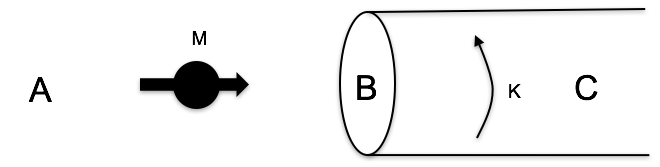

<section data-markdown>

What is the physical interpretation of $\oint \mathbf{A} \cdot d\mathbf{l}$?

1. The current density $\mathbf{J}$
2. The magnetic field $\mathbf{B}$
3. The magnetic flux $\Phi_B$
4. It's none of the above, but is something simple and concrete
5. It has no particular physical interpretation at all

Note:
* CORRECT ANSWER: C

</section>

<section data-markdown>
## Announcements

* Homework 13
  * Due Wednesday Dec 6th
* Last class: Friday Dec 8th
  * Full wrapup of everything we learned this year
  * Don't miss it!
* Final Exam: Tuesday Dec 12th
  * 12:45pm-2:45pm
  * In this room (BPS 1415)
  * See mee for accomodations
</section>

<section data-markdown>
## Special Colloquium

### Danny's promotion talk

* Tuesday, Dec 5th
* 4:10pm-5:10pm
* In this room (BPS 1415)

</section>
<section data-markdown>
## Magnetic Dipoles

</section>

<section data-markdown>
The leading term in the vector potential multipole expansion involves:

$\oint d\mathbf{l}'$

What is the magnitude of this integral?

1. $R$
2. $2\pi R$
3. 0
4. Something entirely different/it depends!

Note:
* CORRECT ANSWER: C

</section>

<section data-markdown>

Two magnetic dipoles $m_1$ and $m_2$ (equal in magnitude) are oriented in three different ways.

Which ways produce a dipole field at large distances?

1. None of these
2. All three
3. 1 only
4. 1 and 2 only
5. 1 and 3 only

Note:
* CORRECT ANSWER: E

</section>

<section data-markdown>

The force on a segment of wire $L$ is $\mathbf{F} = I \mathbf{L} \times \mathbf{B}$ A current-carrying wire loop is in a constant magnetic field $\mathbf{B} = B \hat{z}$ as shown. What is the direction of the torque on the loop?

1. Zero
2. +x
3. +y
4. +z
5. None of these

Note:
* CORRECT ANSWER: B
</section>

<section data-markdown>

The torque on a magnetic dipole in a B field is:

$\mathbf{\tau} = \mathbf{m} \times \mathbf{B}$

How will a small current loop line up if the B field points uniformly up the page?

</section>

<section data-markdown>

Suppose I place a small dipole $\mathbf{M}$ at various locations near the end of a large solenoid. At which point is the magnitude of the force on the dipole greatest?

D) Not enough information to answer

E) There is no net force on a dipole

Recall: $\mathbf{F} = \nabla (\mathbf{m}\cdot\mathbf{B})$

Note:
* CORRECT ANSWER: B

</section>
