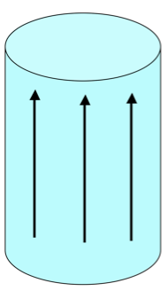

<section data-markdown>

The torque on a magnetic dipole in a B field is:

$\mathbf{\tau} = \mathbf{m} \times \mathbf{B}$

How will a small current loop line up if the B field points uniformly up the page?

</section>

<section data-markdown>

A small chunk of material (the “tan cube”) is placed above a solenoid. It magnetizes, weakly, as shown by small arrows inside.
What kind of material must the cube be?

1. Dielectric
2. Conductor
3. Diamagnetic
4. Paramagnetic
5. Ferromagnetic

Note:
* CORRECT ANSWER: C

</section>

<section data-markdown>

A solid cylinder has uniform magnetization $\mathbf{M}$ throughout the volume in the $x$ direction as shown. What's the magnitude of the total magnetic dipole moment of the cylinder?

1. $\pi R^2 L M$
2. $2\pi R L M$
3. $2\pi R M$
4. $\pi R^2M$
5. Something else/it's complicated!

Note:
* CORRECT ANSWER: A

</section>

<section data-markdown>

A solid cylinder has uniform magnetization $\mathbf{M}$ throughout the volume in the $z$ direction as shown. Where do bound currents show up?

1. Everywhere
2. Volume only, not surface
3. Top/bottom surface only
4. Side (rounded) surface only
5. All surfaces, but not volume

Note:
* CORRECT ANSWER: D

</section>

<section data-markdown>

A solid cylinder has uniform magnetization $\mathbf{M}$ throughout the volume in the $x$ direction as shown. Where do bound currents show up?

1. Top/bottom surface only
2. Side (rounded) surface only
3. Everywhere
4. Top/bottom, and parts of (but not all of) side surface (but not in the volume)
5. Something different/other combination!

Note:
* CORRECT ANSWER: D

</section>

<section data-markdown>

A solid cylinder has uniform magnetization $\mathbf{M}$ throughout the volume in the $\phi$ direction as shown. In which direction does the bound surface current flow on the (curved) sides?

1. There is no bound surface current.
2. The current flows in the $\pm \phi$ direction.
3. The current flows in the $\pm s$ direction.
4. The current flows in the $\pm z$ direction.
5. The direction is more complicated.

</section>

<section data-markdown>

A sphere has uniform magnetization $\mathbf{M}$ in the $+z$ direction. Which formula is correct for this surface current?

1. $M \sin \theta\,\hat{\theta}$
2. $M \sin \theta\,\hat{\phi}$
3. $M \cos \phi\,\hat{\theta}$
4. $M \cos \phi\,\hat{\phi}$
5. Something else

Note:
* CORRECT ANSWER: B

</section>

<section data-markdown>

Predict the results of the following experiment: a paramagnetic bar and a diamagnetic bar are pushed inside of a solenoid.

1. The paramagnet is pushed out, the diamagnet is sucked in
2. The diamagnet is pushed out, the paramagnet is sucked in
3. Both are sucked in, but with different force
4. Both are pushed out, but with different force

Note:
* CORRECT ANSWER: B

</section>

<section data-markdown>

A very long aluminum (paramagnetic!) rod carries a uniformly distributed current $I$ along the $+z$ direction.
What is the direction of the bound volume current?

1. $\mathbf{J}_B$ points parallel to $I$
2. $\mathbf{J}_B$ points anti-parallel to $I$
3. It’s zero!
4. Other/not sure

Note:
* CORRECT ANSWER: A

</section>

<section data-markdown>

A very long aluminum (paramagnetic!) rod carries a uniformly distributed current $I$ along the $+z$ direction. We know $\mathbf{B}$ will be CCW as viewed from above. (Right?) What about $\mathbf{H}$ and $\mathbf{M}$ inside the cylinder?

1. Both are CCW
2. Both are CW
3. $\mathbf{H}$ is CCW, but $\mathbf{M}$ is CW
4. $\mathbf{H}$ is CW, $\mathbf{M}$ is CCW
5. ???

Note:
* CORRECT ANSWER: A
</section>

<section data-markdown>

A very long aluminum (paramagnetic!) rod carries a uniformly distributed current $I$ along the $+z$ direction. What is the direction of the bound volume current?

1. $\mathbf{J}_B$ points parallel to $I$
2. $\mathbf{J}_B$ points anti-parallel to $I$
3. It’s zero!
4. Other/not sure

Note:
* CORRECT ANSWER: A

</section>

<section data-markdown>

A very long aluminum (paramagnetic!) rod carries a uniformly distributed current $I$ along the $+z$ direction. What is the direction of the bound surface current?

1. $\mathbf{K}_B$ points parallel to $I$
2. $\mathbf{K}_B$ points anti-parallel to $I$
3. Other/not sure

Note:
* CORRECT ANSWER: B
</section>
